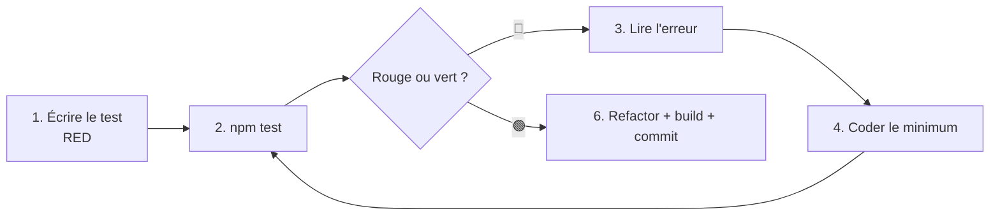

# La boucle rouge → vert (TDD) dans ce projet

Ce skill décrit **la méthode de travail**, pas une commande. Il rend explicite la
boucle qu'on suit pour coder sûrement : on ne devine pas si le code marche, on le
**prouve** avec un critère automatique (les tests).

## L'idée en une phrase

> On écrit d'abord un test qui **échoue** (rouge), puis on écrit le minimum de code
> pour le faire **passer** (vert), et on répète. L'erreur de test est la to-do.

Une boucle n'est **visible que s'il y a un échec à corriger**. En TDD on provoque
volontairement le rouge : c'est ce qui rend la démarche observable et guidée.

## Le cycle, étape par étape

```
1. RED    → écrire le test du comportement voulu (le code n'existe pas encore)
2. RUN    → lancer le critère : `npm test` (échoue = rouge attendu)
3. READ   → lire le message d'erreur : il dit précisément ce qui manque
4. FIX    → écrire le MINIMUM de code pour satisfaire le test
5. RUN    → relancer : vert = fini ; rouge = retour à l'étape 3
6. GREEN  → refactor si besoin, puis élargir le critère (build/lint) et committer
```



## Les commandes de CE projet (le « feu vert »)

Depuis `backend/` :

| Commande | Rôle |
|---|---|
| `npm test` | lance Jest une fois — **le critère rouge/vert** |
| `npm test -- <motif>` | ne lance que les tests dont le fichier matche (ex. `exercises.service.spec`) |
| `npm run test:watch` | **relance automatiquement** à chaque sauvegarde → la boucle tourne seule |
| `npm run build` | compile (SWC) — critère élargi : le code doit aussi compiler |

> Défini dans `backend/package.json` → bloc `"scripts"`. Le mode `watch` est la
> version « la machine gère la boucle » : tu sauvegardes, Jest rejoue tout seul.

## Comment lire le rouge (l'erreur = ta to-do)

Jest te donne l'attendu, le reçu et la ligne. Exemple réellement obtenu dans ce
projet en ajoutant un filtre à `ExercisesService.findAll` :

```
● ExercisesService.findAll › avec bodyweight_only → filtre sur bodyweight_only
    expect(jest.fn()).toHaveBeenCalledWith(...expected)
    Expected: "bodyweight_only", true
    Number of calls: 0
    > 156 |  expect(listBuilder.where).toHaveBeenCalledWith('bodyweight_only', true)
```

Traduction : « le service n'a jamais appelé `where('bodyweight_only', true)` ».
→ La correction évidente : ajouter ce filtre dans le service. C'est la boucle qui
te dicte le pas suivant, tu n'inventes rien.

## Exemple complet vécu (feature `bodyweight_only`)

1. **RED** — ajout d'un test dans `exercises.service.spec.ts` attendant
   `where('bodyweight_only', true)`.
2. **RUN** → `Tests: 1 failed, 10 passed` (`Number of calls: 0`).
3. **READ** → il manque l'appel `where`.
4. **FIX** — dans `exercises.service.ts`, ajout du filtre sur la requête liste ET
   la requête count ; ajout du champ au `ExerciseQueryDto` (avec `@Transform`).
5. **RUN** → `Tests: 11 passed`. 🟢
6. **GREEN** — `npm run build` OK, puis commit.

## Bonnes pratiques (les « garde-fous » de la boucle)

- **Un critère vérifiable et rapide** : sans `npm test` vert/rouge, pas de boucle.
- **Un seul comportement par test** (`it`), nom explicite décrivant la règle métier.
- **Le minimum de code** pour passer au vert — on n'anticipe pas, on laisse les
  prochains tests tirer le code.
- **Petits pas** : un test rouge → vert à la fois, plutôt qu'un gros lot.
- **Élargir le critère** avant de committer : tests + `npm run build` (+ lint si
  pertinent).
- Pour **tester un service qui utilise Knex**, suis le skill `testing-knex-nestjs`
  (mock chaînable + override du provider). Ce skill-ci dit *quand/comment boucler* ;
  l'autre dit *comment écrire le test*.

## Checklist avant de committer

- [ ] J'ai vu le test passer du rouge au vert (pas juste « vert d'emblée »).
- [ ] `npm test` est vert.
- [ ] `npm run build` compile.
- [ ] Chaque `it` teste un seul comportement, nommé clairement.
- [ ] Pas de code non couvert « au cas où » (minimum nécessaire).
