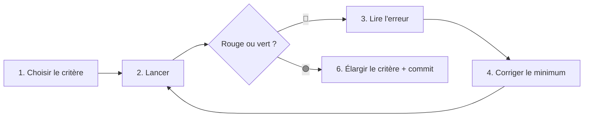

# La boucle de vérification (verification loop)

Ce skill décrit **une méthode de travail**, pas une commande. Principe : on ne
devine jamais si le code marche — on le **prouve** avec un critère automatique, et
on **boucle** jusqu'à ce que ce critère soit vert.

## L'idée en une phrase

> Choisis un critère qui répond par oui/non de façon automatique, lance-le, laisse
> l'erreur te dire quoi corriger, corrige, relance. Répète jusqu'au vert.

Une boucle n'est **visible que s'il y a un échec à corriger**. C'est normal — et
souhaitable : l'échec est l'information qui guide le pas suivant.

## Le cycle générique

```
1. CRITÈRE → choisir la vérification automatique adaptée (test ? build ? lint ? repro ?)
2. RUN     → la lancer
3. READ    → lire le message : il dit précisément ce qui ne va pas
4. FIX     → faire le MINIMUM pour corriger ce point
5. RUN     → relancer : vert = fini ; rouge = retour à l'étape 3
6. DONE    → élargir le critère (ex. tests + build + lint) puis committer
```



## Choisir le bon « feu vert » selon la tâche

Le cœur de la méthode, c'est de **choisir le critère** adapté. Dans CE projet :

| Tâche | Critère (le « feu vert ») | Commande (depuis `backend/`) |
|---|---|---|
| Ajouter/changer un comportement | tests | `npm test` |
| Cibler un fichier de test | tests filtrés | `npm test -- <motif>` |
| Boucle qui se relance seule | tests en continu | `npm run test:watch` |
| Vérifier que ça compile | compilation TypeScript/SWC | `npm run build` |
| Nettoyer style/erreurs statiques | lint | `npm run lint` |
| Appliquer un changement de schéma | migration | `npm run db:migrate` |
| Corriger un bug **sans** test | reproduire puis vérifier la disparition | `curl ...`, script, ou clic dans l'UI |
| Vérifier un endpoint en vrai | réponse HTTP attendue | `curl -i http://localhost:3001/api/...` |

> Les commandes sont dans `backend/package.json` → `"scripts"`. Idéalement, avant de
> committer, on **empile** plusieurs critères : `npm test` **et** `npm run build`.

## Cas 1 — Boucle par les TESTS (TDD)

C'est le cas le plus discipliné : on écrit le test **avant** le code.

1. **RED** — écrire le test du comportement voulu (le code n'existe pas encore).
2. **RUN** → `npm test` échoue (rouge attendu).
3. **READ** — lire l'erreur. Exemple réel obtenu dans ce projet :
   ```
   ● ExercisesService.findAll › avec bodyweight_only → filtre sur bodyweight_only
       Expected: "bodyweight_only", true
       Number of calls: 0
   ```
   → « le service n'appelle jamais `where('bodyweight_only', true)` ».
4. **FIX** — ajouter le filtre dans `exercises.service.ts` + le champ au DTO.
5. **RUN** → `Tests: 11 passed`. 🟢
6. **DONE** — `npm run build` OK, puis commit.

Pour mocker Knex dans un test de service, suivre le skill `testing-knex-nestjs`.

## Cas 2 — Boucle par la COMPILATION

Tu refactores et tu veux juste que ça compile.

1. **RUN** → `npm run build`.
2. **READ** — TypeScript pointe le fichier + la ligne (ex. type manquant, import cassé).
3. **FIX** — corriger précisément ce point.
4. **RUN** → relancer jusqu'à `Successfully compiled`. 🟢

## Cas 3 — Boucle par la REPRO de bug (sans test)

Un bug remonté, pas encore de test.

1. **CRITÈRE** — trouver comment **reproduire** le bug de façon répétable
   (une requête `curl`, une action UI, un petit script). C'est ton « feu rouge ».
2. **RUN** — reproduire → constater le comportement fautif.
3. **FIX** — corriger.
4. **RUN** — refaire exactement la même repro → le bug a disparu = 🟢.
5. **Mieux** : transformer la repro en test (`*.spec.ts`) pour verrouiller la
   non-régression, puis repasser en Cas 1.

## Bonnes pratiques (valables pour tous les cas)

- **Un critère automatique et rapide** : sans réponse oui/non nette, pas de boucle.
- **Petits pas** : une erreur corrigée à la fois, on relance souvent.
- **L'erreur = la to-do** : ne pas deviner, lire ce que l'outil dit.
- **Le minimum** pour passer au vert ; pas de code « au cas où ».
- **Empiler les critères** avant de committer (tests + build, voire lint).
- **Verrouiller** : quand c'est pertinent, convertir une repro en test automatisé.

## Checklist avant de committer

- [ ] J'ai choisi un critère vérifiable adapté à la tâche.
- [ ] J'ai vu passer du rouge au vert (pas juste « vert d'emblée »).
- [ ] Les critères pertinents sont verts : `npm test` et/ou `npm run build` (+ lint).
- [ ] Correction minimale, ciblée sur ce que l'erreur indiquait.
