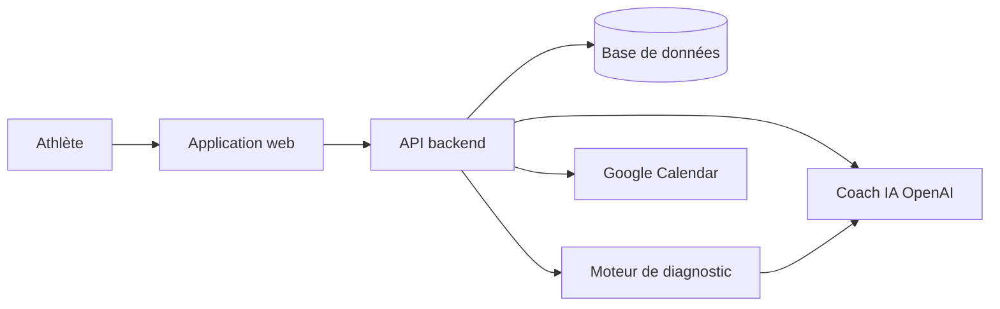
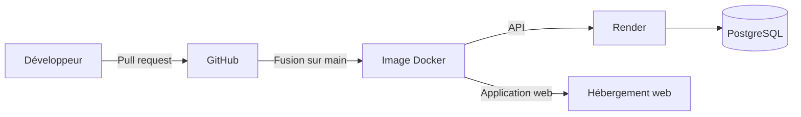

# 🏋️‍♂️ Training Camp

**Training Camp** est un coach CrossFit personnel. Il prépare votre séance du jour, enregistre vos résultats et mesure votre progression avec des chiffres concrets.

---

## Table des matières

- [À quoi sert ce produit ?](#à-quoi-sert-ce-produit-)
- [Fonctionnalités principales](#fonctionnalités-principales)
- [Comment ça fonctionne](#comment-ça-fonctionne)
- [Environnements](#environnements)
- [Déploiement](#déploiement)
- [Stack technique](#stack-technique)
- [Documentation complémentaire](#documentation-complémentaire)

### Documentation technique

| Document | Description |
|----------|-------------|
| [Génération par IA](docs/generation-ia.md) | Les services d'intelligence artificielle, leur contexte partagé et la validation des réponses |
| [Enregistrement d'une séance (log)](docs/flux-log-workout.md) | Comment une séance réalisée est saisie, stockée et reliée au calendrier |
| [Authentification et sécurité](docs/auth-securite.md) | Flux de connexion par cookie, limites de débit et protections en place |
| [Schéma de base de données](docs/schema-base-de-donnees.md) | Tables principales, relations et tables obsolètes |
| [Diagnostic de performance](docs/diagnostic-performance.md) | Indicateurs calculés sans IA, seuils et règles de comparaison |
| [Séance du jour et coach IA](docs/seance-du-jour-coach.md) | Recommandation quotidienne, création automatique du WOD et tâches mensuelles |
| [Calendrier et planification](docs/calendrier-planification.md) | Les deux circuits de planification, le planificateur de la semaine et Google Calendar |
| [Programmes de compétences](docs/programmes-competences.md) | Cycle de vie d'un programme de skill, étapes et journal de progression |

---

## À quoi sert ce produit ?

- Savoir chaque jour quoi faire, sans avoir à construire sa séance soi-même.
- Garder une trace fiable de chaque séance : temps, charges, ressenti d'effort.
- Mesurer objectivement sa progression, avec des indicateurs calculés et non des impressions.
- Repérer ses points faibles : déséquilibres de force, filières énergétiques négligées, surcharge.
- Progresser sur des mouvements techniques grâce à des programmes guidés.

---

## Fonctionnalités principales

- **Séance du jour automatique** — À la première visite du tableau de bord, le coach IA planifie la séance adaptée, ou recommande du repos.
- **Test de benchmark mensuel** — Un benchmark est planifié chaque mois, en priorité celui testé il y a le plus longtemps.
- **Génération de WOD (Workout Of the Day) par IA** — Séances adaptées au niveau, au matériel et à la fatigue récente.
- **Catalogue de WOD** — WOD de référence et benchmarks officiels (Fran, Grace, Murph…).
- **Log de séance** — Saisie des résultats par exercice, de l'effort ressenti et import de fichiers de montre (FIT).
- **Diagnostic de performance** — Ratios de force, progression sur les benchmarks, charge d'entraînement, régularité.
- **Bilans mensuels** — Synthèse rédigée par l'IA à partir des chiffres du diagnostic.
- **Analyse post-séance** — Retour personnalisé du coach après chaque WOD.
- **Records personnels (1RM)** — Charge maximale par mouvement et historique de son évolution.
- **Programmes de compétences (skills)** — Progressions guidées vers un mouvement gymnique ou d'haltérophilie.
- **Calendrier** — Planification des séances, avec synchronisation Google Calendar.
- **Application installable** — Utilisable sur mobile comme une application native (PWA).

---

## Comment ça fonctionne

L'athlète utilise l'application web, sur ordinateur ou sur mobile. L'API backend stocke les séances et calcule le diagnostic de performance sans IA. Ce diagnostic est ensuite transmis au coach IA. Ainsi, les séances générées, les recommandations et les bilans s'appuient tous sur les mêmes chiffres.

---

## Environnements

| Environnement | URL | Description |
|---|---|---|
| Développement | `http://localhost:3000` (application) / `http://localhost:3001/api` (API) | Poste local, base de données dans Docker |
| Production (API) | `https://training-camp.onrender.com/api` | API hébergée sur Render |
| Production (application) | *À préciser* | Hébergement du frontend non documenté dans le dépôt |

---

## Déploiement

Le code est hébergé sur GitHub et chaque évolution passe par une pull request. Le backend et le frontend disposent chacun d'une image Docker. L'API est déployée sur Render, reliée à une base PostgreSQL. Aucun pipeline CI/CD (Intégration et Déploiement Continus) n'est configuré dans le dépôt : les tests et le lint se lancent manuellement.

> **Point de vigilance** : après un déploiement, les migrations de base de données doivent être appliquées en production.

---

## Stack technique

- **Frontend :** Next.js 16 (React 19), TypeScript, TailwindCSS, Radix UI, Recharts
- **Backend :** NestJS 11, TypeScript, Knex.js
- **Base de données :** PostgreSQL 15
- **Intelligence artificielle :** OpenAI (modèle `gpt-4.1`)
- **Hébergement :** Docker, Render

---

## Documentation complémentaire

- [Génération par IA](docs/generation-ia.md)
- [Enregistrement d'une séance (log)](docs/flux-log-workout.md)
- [Authentification et sécurité](docs/auth-securite.md)
- [Schéma de base de données](docs/schema-base-de-donnees.md)
- [Diagnostic de performance](docs/diagnostic-performance.md)
- [Séance du jour et coach IA](docs/seance-du-jour-coach.md)
- [Calendrier et planification](docs/calendrier-planification.md)
- [Programmes de compétences](docs/programmes-competences.md)
