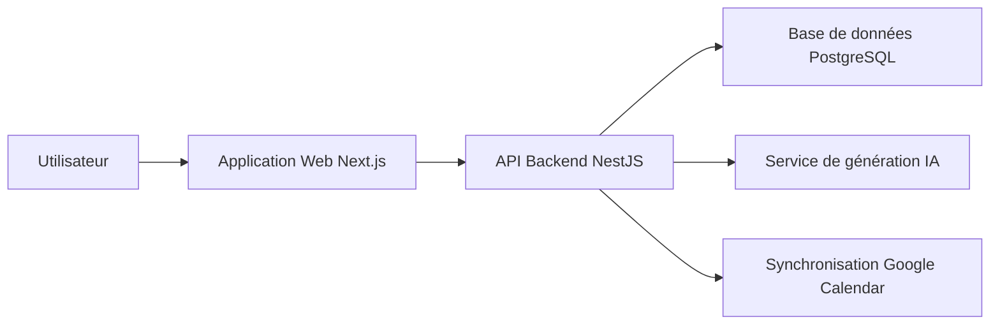
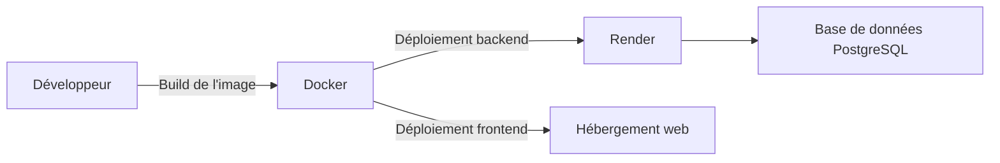

# 🏋️‍♂️ Training Camp

**Training Camp** est une plateforme multi-sports (cross-training, force, running, vélo, mobilité) qui génère des séances d'entraînement personnalisées grâce à l'intelligence artificielle. Chaque programme s'adapte au profil, au matériel disponible et aux objectifs de l'utilisateur.

---

## Table des matières

- [À quoi sert ce produit ?](#à-quoi-sert-ce-produit-)
- [Fonctionnalités principales](#fonctionnalités-principales)
- [Comment ça fonctionne](#comment-ça-fonctionne)
- [Environnements](#environnements)
- [Déploiement](#déploiement)
- [Stack technique](#stack-technique)
- [Documentation complémentaire](#documentation-complémentaire)

### Documentation technique

| Document | Description |
|----------|-------------|
| [Génération de séances par IA](docs/generation-ia.md) | Comment l'intelligence artificielle génère les séances pour chaque sport |
| [Enregistrement d'une séance (log)](docs/flux-log-workout.md) | Comment un utilisateur enregistre le résultat d'une séance réalisée |
| [Authentification et sécurité](docs/auth-securite.md) | Flux de connexion, cookie JWT, mesures de sécurité en place |
| [Schéma de base de données](docs/schema-base-de-donnees.md) | Tables principales et relations entre les données |

---

## À quoi sert ce produit ?

- Générer des séances d'entraînement personnalisées par intelligence artificielle, sport par sport.
- Centraliser plusieurs disciplines : cross-training, force, running, vélo, mobilité.
- Suivre l'historique des séances et analyser la progression après chaque entraînement.
- Planifier ses entraînements dans un calendrier, avec synchronisation Google Calendar.
- Gérer des programmes de progression sur des compétences gymniques ou d'haltérophilie (skills).
- Suivre ses records personnels (1RM) et leur évolution dans le temps.

---

## Fonctionnalités principales

- **Génération de séances par IA** — WOD (Workout Of the Day) et séances adaptées au profil, au matériel et à la fatigue, pour le cross-training, la force, le running, le vélo et la mobilité.
- **Profil utilisateur** — Prise en compte du niveau, des objectifs, des blessures et de l'équipement disponible.
- **Suivi des records personnels** — Historique des 1RM (charges maximales) par exercice.
- **Programmes de compétences (skills)** — Progressions guidées sur des mouvements gymniques ou d'haltérophilie.
- **Calendrier d'entraînement** — Planification des séances avec synchronisation vers Google Calendar.
- **Historique et analyse post-séance** — Log des entraînements réalisés et retour d'analyse généré par IA.
- **Import de données d'activité** — Import de fichiers FIT (montres et capteurs sportifs).
- **Tableau de bord** — Vue d'ensemble de l'activité et de la progression de l'utilisateur.
- **Timer intégré** — Chronomètre pour suivre ses séances en temps réel (AMRAP, for time, etc.).

---

## Comment ça fonctionne

L'utilisateur interagit avec l'application web pour créer et suivre ses séances. L'API backend gère la logique métier, appelle un service d'intelligence artificielle pour générer les entraînements, et stocke toutes les données en base. Une synchronisation optionnelle avec Google Calendar permet de retrouver ses séances planifiées dans son agenda personnel.

---

## Environnements

| Environnement | URL | Description |
|---|---|---|
| Développement | `http://localhost:3000` (frontend) / `http://localhost:3001/api` (backend) | Environnement local, base de données via Docker |
| Production | `https://training-camp.onrender.com/api` (backend) | Environnement de production hébergé sur Render |

---

## Déploiement

Le backend et le frontend sont conteneurisés avec Docker. Le backend est déployé sur Render, connecté à une base de données PostgreSQL hébergée. Il n'existe pas encore de pipeline d'intégration continue (CI/CD) automatisé : les déploiements sont réalisés manuellement.

---

## Stack technique

- **Frontend :** Next.js 16 (React 19), TypeScript, TailwindCSS, Radix UI
- **Backend :** NestJS 11, TypeScript, PostgreSQL, Knex.js
- **Intelligence artificielle :** OpenAI (modèle `gpt-4.1`)
- **Authentification :** JWT (JSON Web Token) via Passport.js
- **Infrastructure :** Docker, Render

---

## Documentation complémentaire

- [Génération de séances par IA](docs/generation-ia.md)
- [Enregistrement d'une séance (log)](docs/flux-log-workout.md)
- [Authentification et sécurité](docs/auth-securite.md)
- [Schéma de base de données](docs/schema-base-de-donnees.md)
