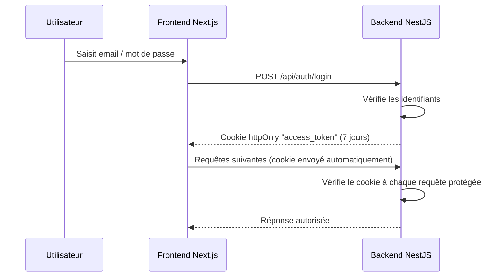

# Authentification et sécurité

Ce document décrit comment Training Camp authentifie ses utilisateurs et quelles mesures protègent l'application. Il s'adresse aux Product Owners souhaitant comprendre le niveau de sécurité du produit, et aux développeurs intervenant sur l'authentification ou les API.

> **Point d'attention** : le jeton de connexion (JWT) est désormais transmis via un cookie **httpOnly**, et non plus stocké dans le stockage local du navigateur. Cette migration, identifiée comme un chantier à venir dans une version antérieure de la documentation, est aujourd'hui effective.

## Flux de connexion

Après connexion, le navigateur envoie automatiquement le cookie à chaque requête : le frontend n'a pas besoin de gérer le jeton manuellement. Le frontend appelle systématiquement l'API via une réécriture d'URL Next.js (`/api` → backend), afin que le cookie soit toujours considéré comme "même origine" et ne soit pas bloqué par les navigateurs mobiles.

## Mesures de sécurité en place

| Mesure | Description |
|---|---|
| **Authentification obligatoire** | Toutes les routes protégées exigent un jeton valide (`JwtAuthGuard`), y compris les routes de génération IA — sans exception. |
| **Cookie httpOnly** | Le jeton n'est jamais accessible en JavaScript côté navigateur, ce qui réduit le risque de vol par une faille XSS (injection de script). |
| **CORS restreint** | Seule l'URL du frontend (variable `FRONTEND_URL`) est autorisée à appeler l'API, avec transmission des cookies activée. |
| **Limitation de débit (rate limiting)** | Un nombre maximal de requêtes par minute est imposé, pour éviter les abus et maîtriser les coûts d'IA. |
| **Validation stricte des données** | Tout champ non prévu dans une requête est rejeté (HTTP 400), ce qui empêche l'envoi de données inattendues. |
| **En-têtes de sécurité (Helmet)** | Des en-têtes HTTP standards protègent contre plusieurs attaques web courantes. |
| **Secret obligatoire** | L'application refuse de démarrer si la clé secrète de signature des jetons (`JWT_SECRET`) n'est pas configurée. |

## Limites de débit par route

| Route | Limite |
|---|---|
| Routes générales | 60 requêtes / minute / IP |
| Connexion (`/auth/login`) | 10 requêtes / minute |
| Inscription (`/auth/signup`) | 5 requêtes / minute |
| Génération IA (workouts, skills, force, running, vélo, mobilité, programmes) | 10 requêtes / minute |
| Recommandations (lecture) | 60 requêtes / minute |
| Recommandations (génération) | 5 requêtes / minute |

> **Détail technique**
>
> Le jeton est extrait par `JwtStrategy` en priorité depuis le cookie `access_token`, avec un repli sur l'en-tête `Authorization: Bearer` pour compatibilité (ex. appels API hors navigateur). Le cookie est configuré avec `secure: true` et `sameSite: 'none'` en production (nécessaire pour un cookie cross-site en HTTPS), et `sameSite: 'lax'` en développement local.
>
> La validation des DTOs (`class-validator`) est appliquée globalement avec `whitelist: true` et `forbidNonWhitelisted: true` : un champ non déclaré dans un DTO provoque un rejet immédiat de la requête.
