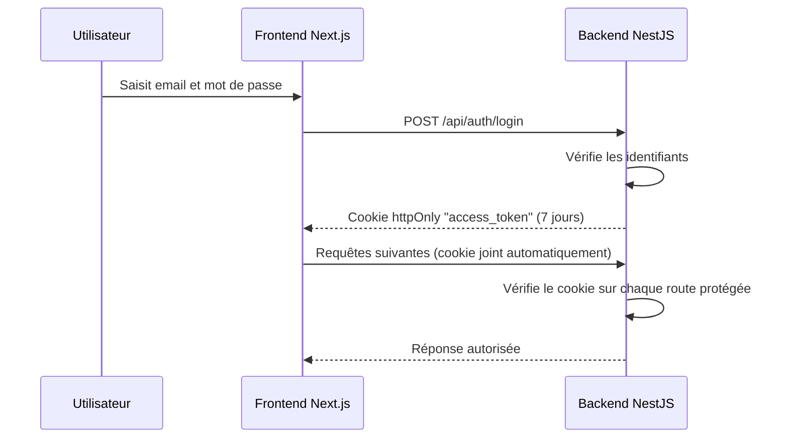
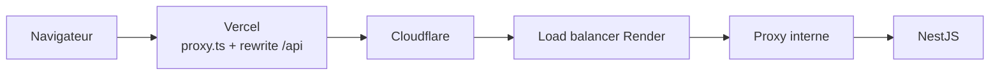

# Authentification et sécurité

Ce document décrit comment Training Camp authentifie ses utilisateurs et quelles mesures protègent l'application. Il s'adresse aux Product Owners et aux développeurs qui touchent à l'authentification ou aux API.

## Flux de connexion

```mermaid
sequenceDiagram
    participant U as Utilisateur
    participant F as Frontend Next.js
    participant B as Backend NestJS

    U->>F: Saisit email et mot de passe
    F->>B: POST /api/auth/login
    B->>B: Vérifie les identifiants
    B-->>F: Cookie httpOnly "access_token" (7 jours)
    F->>B: Requêtes suivantes (cookie joint automatiquement)
    B->>B: Vérifie le cookie sur chaque route protégée
    B-->>F: Réponse autorisée
```

Après la connexion, le navigateur joint le cookie à chaque requête. Le frontend n'a donc aucun jeton à manipuler.

Le frontend appelle toujours l'API via une réécriture d'URL Next.js (`/api` → backend). Le cookie reste ainsi « même origine ». Les navigateurs mobiles ne le bloquent donc pas.

## Mesures de sécurité en place

| Mesure | Ce qu'elle protège |
|---|---|
| **Authentification obligatoire** | Toutes les routes protégées exigent un jeton valide (`JwtAuthGuard`), y compris les routes IA. |
| **Cookie httpOnly** | Le jeton est inaccessible en JavaScript. Cela limite le vol par faille XSS (injection de script). |
| **CORS restreint** | Seule l'URL du frontend (`FRONTEND_URL`) peut appeler l'API, cookies inclus. CORS : partage de ressources entre origines. |
| **Limitation de débit** | Un nombre maximal de requêtes par minute limite les abus et les coûts d'IA. |
| **Validation stricte** | Tout champ non prévu dans une requête est rejeté (HTTP 400). |
| **En-têtes de sécurité** | Helmet côté API et en-têtes dédiés côté Next.js contrent plusieurs attaques web courantes. |
| **Secret obligatoire** | L'API refuse de démarrer sans clé de signature des jetons (`JWT_SECRET`). |
| **Verrou d'origine** | L'API n'accepte que les requêtes passées par le frontend. Un appel direct à Render est refusé (HTTP 403), ce qui empêche de contourner la limitation de débit. |

## Verrou d'origine et IP du client

En production, une requête traverse plusieurs intermédiaires avant d'atteindre l'API :

```mermaid
graph LR
    A[Navigateur] --> B[Vercel<br/>proxy.ts + rewrite /api]
    B --> C[Cloudflare]
    C --> D[Load balancer Render]
    D --> E[Proxy interne]
    E --> F[NestJS]
```

Deux réglages en découlent :

| Variable (Render) | Rôle |
|---|---|
| `TRUST_PROXY` | Nombre d'intermédiaires de confiance. L'API s'en sert pour retrouver la vraie IP de l'utilisateur dans l'en-tête `X-Forwarded-For`. Sans ce réglage, tous les utilisateurs partagent le même compteur de débit. Valeur mesurée pour la chaîne ci-dessus : `4`. |
| `ORIGIN_SECRET` | Secret partagé avec Vercel (même variable, même valeur). `frontend/proxy.ts` l'ajoute à chaque requête `/api` dans l'en-tête `x-origin-secret`. L'API refuse toute requête qui ne le porte pas, sauf `GET /api/health` (health check de Render). |

> **Pourquoi les deux vont ensemble**
>
> Avec `TRUST_PROXY=4`, l'API fait confiance à une partie de `X-Forwarded-For`. Sans verrou, un attaquant qui appelle Render en direct peut écrire une fausse IP dans cet en-tête et contourner la limitation de débit. Il faut donc activer `ORIGIN_SECRET` **avant** `TRUST_PROXY`.
>
> Si l'hébergement change (autre hébergeur, CDN ajouté ou retiré), le nombre d'intermédiaires change aussi. `TRUST_PROXY` doit alors être mesuré de nouveau.

## Limites de débit par route

| Route | Limite par minute |
|---|---|
| Toutes les routes (par défaut) | 60 |
| Connexion (`POST /auth/login`) | 10 |
| Inscription (`POST /auth/signup`) | 5 |
| Génération de WOD (`POST /workouts/generate-ai`, `/generate-ai-personalized`) | 10 |
| Import d'un WOD (`POST /workouts/parse-text`, `/lookup`) | 10 |
| Génération de programme de compétence (`POST /skills/generate-ai`) | 10 |
| Analyse post-séance (`POST /workout-sessions/:id/analyze`) | 10 |
| Séance du jour (`GET /recommendations/daily-session/check`) | 10 |
| Bilan de progression à la demande (`GET /tracking/report`) | 10 |
| Recommandation du coach — lecture / régénération | 60 / 5 |

> **Exception assumée** : `GET /tracking/report/check-monthly` garde la limite par défaut. Il est appelé à chaque connexion et ne génère qu'un bilan par mois.

> **Détail technique**
>
> `JwtStrategy` lit le jeton d'abord dans le cookie `access_token`. À défaut, il lit l'en-tête `Authorization: Bearer` (appels hors navigateur).
>
> Le cookie est posé avec `sameSite: 'lax'`, et `secure: true` en production. Comme le frontend passe par le rewrite Next.js, le cookie est « même origine » : `'lax'` suffit et empêche qu'un autre site déclenche une requête POST authentifiée (attaque CSRF). Ne pas repasser en `'none'` tant que le navigateur n'appelle pas le backend en direct.
>
> La validation des DTOs (`class-validator`) est globale, avec `whitelist: true` et `forbidNonWhitelisted: true`.
