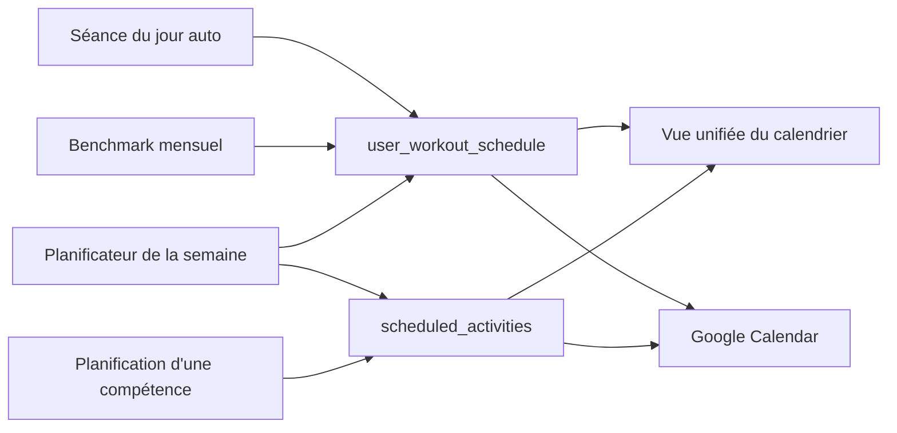

# Calendrier et planification

Ce document explique comment les séances sont planifiées et affichées dans le calendrier. Il s'adresse aux Product Owners et aux développeurs qui touchent au calendrier, au planificateur de la semaine ou à Google Calendar.

## Principe

- Le calendrier affiche **une vue unifiée** de tout ce qui est prévu.
- Derrière, deux tables stockent la planification, selon le type d'activité.
- Une seule activité d'un même type est autorisée par jour.

| Ce qui est planifié | Table | Exemple |
|---|---|---|
| Un WOD précis (catalogue ou généré par IA) | `user_workout_schedule` | Séance du jour, benchmark mensuel |
| Un jour « box » (séance faite en salle, sans WOD associé) | `user_workout_schedule` | Type `box_session` |
| Une séance de compétence | `scheduled_activities` | Travail muscle-up |
| Un créneau `wod` ou `conditioning` sans WOD précis | `scheduled_activities` | Posé par le planificateur de la semaine |

## Comment ça fonctionne

Plusieurs sources créent des créneaux. Le calendrier fusionne les deux tables en une seule liste. Chaque nouveau créneau est aussi envoyé à Google Calendar si l'athlète l'a connecté.

## Cycle de vie d'un créneau

| Statut | Signification |
|---|---|
| Prévu | Séance à venir |
| Complété | Séance réalisée. Pour un WOD, le créneau est relié à la séance enregistrée |
| Sauté | Séance non faite, volontairement |

Pour marquer un WOD comme complété, l'athlète passe par la page de log (voir [Enregistrement d'une séance](flux-log-workout.md)).

## Planificateur de la semaine

L'athlète indique, pour chaque jour de la semaine, ce qu'il prévoit. Aucune séance n'est générée à cette étape : le planificateur pose seulement des « étiquettes ».

- **Jour « box »** : un créneau `box_session` est réservé dans `user_workout_schedule`.
- **WOD ou Conditioning** (exclusifs l'un de l'autre) : un créneau `wod` ou `conditioning` dans `scheduled_activities`.
- **Force** : un créneau `strength` dans `scheduled_activities`.
- **Jour de repos** : rien n'est créé.
- **Jour déjà occupé** : il est ignoré et signalé.

Le contenu du WOD est généré ensuite, depuis la page de génération.

> **Point d'attention** : le type `strength` est un reste de l'ancien module force, supprimé depuis. Il est encore accepté par l'API. Par ailleurs, l'endpoint `POST /workouts/weekly-plan`, qui générait les WOD de la semaine par IA, n'est plus appelé par le frontend.

## Synchronisation Google Calendar

- L'athlète connecte son compte Google depuis l'application (autorisation OAuth).
- Chaque nouveau créneau crée un événement dans son agenda principal, à 7 h, sur la durée prévue.
- La synchronisation est **à sens unique et à la création seulement** : déplacer ou supprimer un créneau ne modifie pas l'événement Google.
- Une erreur Google ne bloque jamais la planification.

> **Détail technique**
>
> | Endpoint | Rôle |
> |---|---|
> | `GET /scheduled-activities/unified` | Vue fusionnée des deux tables, filtrable par dates et statut |
> | `/workout-schedule/*` | CRUD, `complete`, `skip`, `by-date/:date`, `week-suggestion` |
> | `/scheduled-activities/*` | CRUD, `complete`, `skip` |
> | `/calendar/google/*` | `auth-url`, `callback`, `status`, `disconnect` |
>
> - Le refresh token Google est stocké dans `users.google_refresh_token`.
> - Un doublon (même type, même date) lève une `ConflictException` (HTTP 409).
> - `scheduled_activities.activity_id` est polymorphe, sans clé étrangère. Pour `skill`, il pointe vers `skill_programs`.