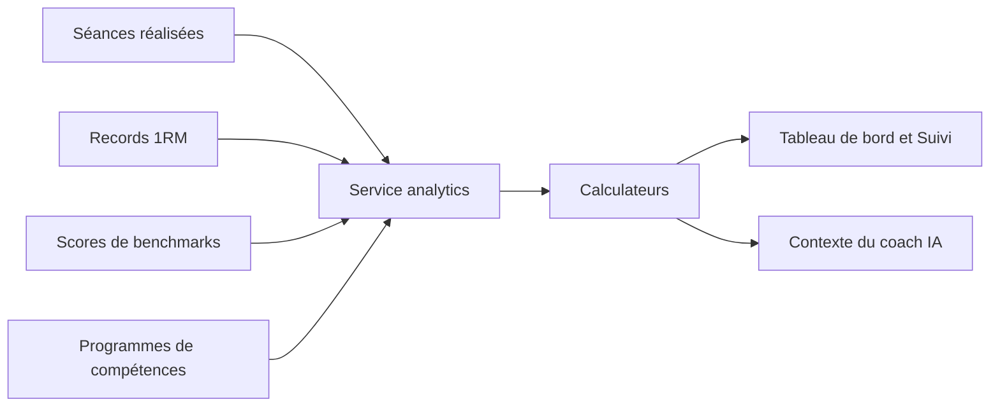

# Diagnostic de performance

Ce document décrit comment Training Camp mesure la progression d'un athlète.

## Principe

- Le diagnostic est **calculé, sans IA**. Les chiffres sont reproductibles et vérifiables.
- Il est affiché sur le tableau de bord et dans l'onglet « Diagnostic » de la page Suivi.
- Il est aussi transmis au coach IA, qui s'appuie dessus sans jamais le recalculer.
- **Règle métier** : un benchmark ne se compare qu'à lui-même. On ne compare jamais deux WOD différents parce qu'ils ont le même format.

## Comment ça fonctionne

Le service lit les données de l'athlète sur la période choisie (3 mois par défaut, de 1 à 12). Il les confie à des calculateurs indépendants. Le résultat alimente l'écran et le contexte de l'IA.

## Les indicateurs

| Indicateur | Question à laquelle il répond | Données nécessaires |
|---|---|---|
| **Ratios de force** | Mes lifts sont-ils équilibrés entre eux ? | 1RM |
| **Historique de force** | Mes 1RM progressent-ils ? | Historique des 1RM |
| **Progression par benchmark** | Suis-je meilleur sur Fran qu'avant ? | Scores de benchmarks |
| **Filières énergétiques** | Est-ce que je travaille toutes les durées d'effort ? | Durée des séances |
| **Volume et régularité** | Combien de séances par semaine, et avec quelle constance ? | Dates des séances |
| **Charge d'entraînement** | Est-ce que j'augmente la charge trop vite ? | RPE et durée |
| **Exposition par mouvement** | Quels mouvements je vois peu ou scale souvent ? | Résultats par exercice |
| **Avancement des compétences** | Où en suis-je dans mes programmes de skills ? | Étapes des programmes |

Un indicateur sans données n'est pas affiché. Les indicateurs **charge** et **exposition** restent vides tant que l'athlète ne saisit ni RPE ni résultats par exercice.

## Ratios de force

Fourchettes cibles indicatives. Elles varient selon le gabarit, l'âge et l'ancienneté.

| Ratio | Fourchette cible |
|---|---|
| Snatch / Clean & Jerk | 78 – 82 % |
| Front Squat / Back Squat | 82 – 88 % |
| Clean & Jerk / Back Squat | 70 – 75 % |
| Deadlift / Back Squat | 120 – 130 % |
| Overhead Squat / Back Squat | 60 – 70 % |

Chaque écart est accompagné d'une interprétation de coach : cause probable et piste de travail.

## Filières énergétiques

| Domaine | Durée d'effort |
|---|---|
| Puissance | moins de 3 min |
| Glycolytique | 3 à 8 min |
| Mixte | 8 à 15 min |
| Aérobie | 15 à 30 min |
| Aérobie long | plus de 30 min |

Un domaine sous 10 % des séances est signalé comme délaissé. Ce signal n'apparaît qu'à partir de 8 séances chronométrées.

## Charge d'entraînement (sRPE et ACWR)

- **sRPE** (session RPE) = effort ressenti × durée en minutes. Sans durée, 60 minutes sont retenues.
- **ACWR** (Acute:Chronic Workload Ratio) = charge des 7 derniers jours / moyenne hebdomadaire des 28 derniers jours.
- L'ACWR n'est calculé qu'après 28 jours d'historique, pour éviter une fausse alerte en début d'utilisation.

| ACWR | Zone |
|---|---|
| moins de 0,8 | Charge basse, marge pour monter |
| 0,8 à 1,3 | Zone optimale |
| 1,3 à 1,5 | Vigilance |
| plus de 1,5 | Risque élevé : réduire le volume |

## Autres seuils

| Règle | Valeur |
|---|---|
| Tendance d'un benchmark | stable si la variation reste sous 3 % |
| Tendance d'un 1RM | stable si la variation reste sous 0,5 kg |
| Mouvement « souvent scalé » | au moins 3 expositions et au moins 50 % scalées |
| Étape de compétence franchie | statut `completed` ou `skipped` |

> **Détail technique**
>
> - Endpoint : `GET /api/analytics/overview?months=3`, protégé par `JwtAuthGuard`.
> - `analytics.service.ts` fait les requêtes Knex. Les calculateurs de `analytics/calculators/` font les maths.
> - Les calculateurs sont des **fonctions pures** : testez-les directement, sans mock de Knex.
> - La date de référence (`now`) est injectable, pour des tests déterministes.
> - La synthèse transmise à l'IA est construite par `UserContextService`, puis formatée par `common/ai/diagnostic-prompt.ts`.
