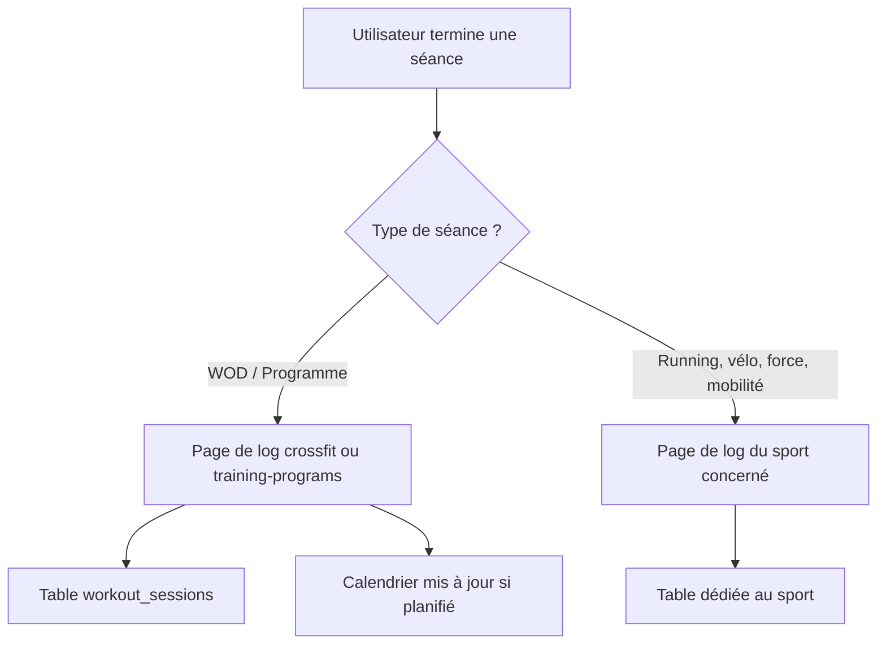

# Enregistrement d'une séance réalisée (log)

Ce document explique comment un utilisateur enregistre le résultat d'une séance dans Training Camp. Il s'adresse aux Product Owners et aux développeurs découvrant le fonctionnement multi-sport de l'application.

> **Point d'attention** : ce document remplace une ancienne description qui mentionnait deux modales (`LogWorkoutModal` et `WorkoutResultModal`) utilisant respectivement l'API et le stockage local du navigateur. Ces composants ont depuis été remplacés par des pages dédiées ; l'architecture actuelle est décrite ci-dessous.

## Deux familles de séances, deux circuits d'enregistrement

Training Camp distingue deux types de séances, chacun avec son propre circuit d'enregistrement :

1. **Séances WOD et programmes** (cross-training, programmes d'entraînement) — reposent sur une table unique de sessions.
2. **Séances par sport** (running, vélo, force, mobilité) — chaque sport possède sa propre table de sessions et son propre service.

L'utilisateur accède toujours à une page de log dédiée (jamais une fenêtre modale). Selon le sport, la séance est enregistrée dans la table commune `workout_sessions` ou dans une table spécifique au sport.

## Pages de log par sport

| Page | Sport | Service frontend | Table backend |
|---|---|---|---|
| `/crossfit/log-workout` | Cross-training (WOD) | `sessionService` | `workout_sessions` |
| `/training-programs/log-session` | Programmes d'entraînement | `sessionService` | `workout_sessions` |
| `/running/log` | Running | `runningService` | `running_sessions` |
| `/biking/log` | Vélo | `bikingService` | `biking_sessions` |
| `/force/log` | Force / musculation | `strengthService` | `strength_sessions` |

## Lien avec le calendrier

Depuis le calendrier, seules les séances **cross-training** et **programmes** peuvent être marquées comme complétées directement : le clic redirige vers la page de log avec un identifiant de planification (`scheduleId`) dans l'URL. Une fois la séance enregistrée, l'entrée du calendrier (table `user_workout_schedule`) est automatiquement mise à jour via `scheduleApi.markAsCompleted`.

Les autres sports (running, vélo, force, mobilité) apparaissent dans le calendrier via un registre unifié en lecture (`scheduled_activities`), mais leur enregistrement se fait indépendamment, depuis la page de log de leur module respectif.

> **Détail technique**
>
> `sessionService` fonctionne en deux temps : `startSession()` crée la session avec une date de début, puis `updateSession()` la complète avec les résultats (`results` en JSON : temps, rounds, cap atteint, notes par exercice, données importées d'un fichier `.fit`, etc.). Une session référence soit un `workout_id` (WOD du catalogue), soit un `personalized_workout_id` (WOD généré par IA pour l'utilisateur), jamais les deux.
>
> L'import de fichiers `.fit` (montres et capteurs type Coros) est disponible sur toutes les pages de log : il pré-remplit automatiquement la durée, la distance et les zones de fréquence cardiaque.
