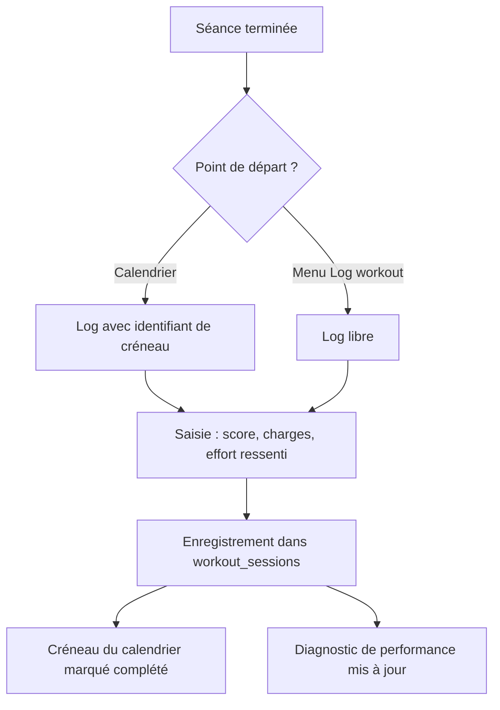

# Enregistrement d'une séance réalisée (log)

Ce document explique comment un athlète enregistre le résultat d'une séance. Il s'adresse aux Product Owners et aux développeurs qui touchent à la saisie ou au calendrier.

## Principe

- **Une seule page de log** : `/crossfit/log-workout`. Il n'y a pas de fenêtre modale.
- **Une seule table** : chaque séance réalisée est stockée dans `workout_sessions`.
- **La force n'est pas un module séparé** : c'est une section de type `strength` dans une séance CrossFit.
- **Les compétences (skills)** ont leur propre journal de progression, distinct du log de WOD.

## Parcours de l'athlète

Depuis le calendrier, le lien vers la page de log transporte l'identifiant du créneau (`scheduleId`). Après l'enregistrement, ce créneau passe au statut « complété ». Le diagnostic de performance relit ensuite les séances pour recalculer les indicateurs.

## Ce que l'athlète saisit

| Donnée | Utilité |
|---|---|
| **Score du WOD** | Temps, rounds ou répétitions, ou cap atteint avec le travail partiel |
| **Résultat par exercice** | Charge, répétitions, séries, version adaptée (scaled) ou non |
| **Effort ressenti (RPE)** | Échelle de 1 à 10. Croisé avec la durée, il mesure la charge d'entraînement |
| **Appréciation et notes** | Note de 1 à 5 et commentaire libre |
| **Fichier de montre (FIT)** | Pré-remplit durée, distance et zones de fréquence cardiaque |

Sans RPE ni résultats par exercice, certains indicateurs du diagnostic restent vides. C'est attendu, pas un bug.

## Compétences (skills)

Le travail technique suit un circuit à part :

- La planification passe par la table `scheduled_activities` (type `skill`).
- La progression se note depuis la page du programme (`/skills/[id]`), dans `skill_progress_logs`.

> **Détail technique — enregistrement**
>
> `sessionService` procède en deux temps :
> 1. `startSession()` crée la session avec sa date de début.
> 2. `updateSession()` la complète avec `completed_at`, `notes` et `results`.
>
> Ensuite, si `scheduleId` est présent, `scheduleApi.markAsCompleted(scheduleId, sessionId)` met à jour `user_workout_schedule`.
>
> Une session référence soit un `workout_id` (catalogue), soit un `personalized_workout_id` (WOD généré par IA), jamais les deux.

> **Détail technique — contrat du champ `results`**
>
> `results` est un `jsonb` validé par `SessionResultsSchema` (Zod, dans `workout-sessions/schemas/`).
>
> | Champ | Type | Remarque |
> |---|---|---|
> | `elapsed_time_seconds`, `rounds`, `reps` | entier | Score du conditionnement |
> | `cap_reached`, `rounds_completed`, `partial_note` | divers | Cas du time cap atteint |
> | `rating` | 1 à 5 | Appréciation |
> | `rpe` | 1 à 10 | Échelle CR-10 |
> | `exercise_results` | tableau | Une entrée **par exercice**, pas par série |
>
> Dans `exercise_results`, `load_kg` porte la charge la plus lourde travaillée.
>
> Le schéma utilise `.passthrough()`. Les anciennes clés (`coros`, `exercise_details`, `block_progress`…) sont donc conservées. `exercise_details` (texte libre) reste en lecture seule.
