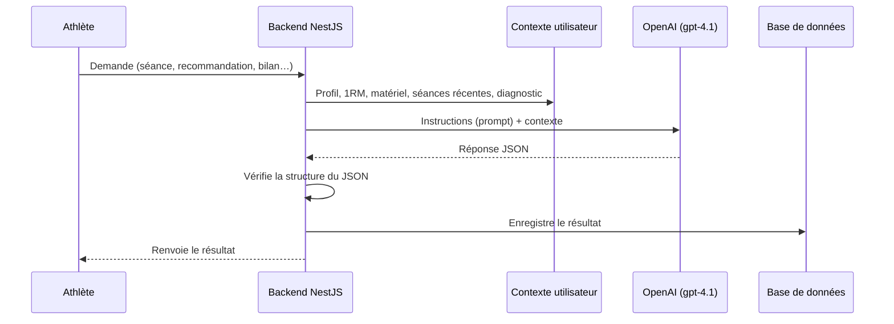

# Génération par intelligence artificielle

Ce document présente les services qui font appel à l'IA dans Training Camp. Il s'adresse aux Product Owners qui veulent comprendre le rôle du coach IA, et aux développeurs qui ajoutent ou modifient un service IA.

## Rôle de l'IA dans le produit

L'IA **rédige et propose**, elle ne **mesure** pas.

- Les chiffres (ratios de force, charge d'entraînement, progression) sont calculés sans IA par le module `analytics`.
- L'IA reçoit ces chiffres et s'en sert pour générer une séance, recommander quoi faire ou rédiger un bilan.
- Le prompt lui interdit de recalculer ou de contredire ces chiffres.

Ainsi, la séance générée, la recommandation et le bilan mensuel s'appuient tous sur les mêmes données.

## Comment ça fonctionne

Le backend enrichit chaque demande avec le profil complet de l'athlète. La réponse de l'IA est vérifiée avant d'être enregistrée. Un contenu mal formé n'atteint donc pas la base de données.

## Les services IA existants

| Service | Module | Ce qu'il produit |
|---|---|---|
| `AIWorkoutGeneratorService` | `workouts` | WOD personnalisé, WOD extrait d'un texte collé, WOD officiel retrouvé par son nom |
| `AISkillGeneratorService` | `skills` | Programme de progression vers une compétence (muscle-up, handstand…) |
| `WorkoutAnalysisService` | `workout-sessions` | Retour du coach après une séance terminée |
| `RecommendationsService` | `recommendations` | Recommandation de la prochaine séance (type, intensité, justification) |
| `DailySessionService` | `recommendations` | Transforme la recommandation en séance du jour planifiée |
| `TrackingService` | `tracking` | Bilan mensuel de progression |

## La séance du jour automatique

La carte « Séance du jour » du tableau de bord déclenche la création du WOD du jour. Le fonctionnement complet est décrit dans [Séance du jour et coach IA](seance-du-jour-coach.md).

Le bilan mensuel, lui, est vérifié à chaque connexion. Il n'est régénéré qu'une fois par mois calendaire.

## Contexte utilisateur partagé

**`UserContextService`** (exporté par `WorkoutsModule`) construit le contexte transmis à l'IA :

- niveau, objectifs, blessures, matériel disponible ;
- 1RM (records de force) ;
- séances et analyses récentes ;
- compétences en cours de progression ;
- synthèse du **diagnostic calculé** (champ `diagnostic`).

Tout nouveau service IA doit injecter ce service.

> **Détail technique**
>
> Le client OpenAI est partagé via `OpenAIClientService` (`common/ai/`). Chaque appel utilise :
> - `model: 'gpt-4.1'` ;
> - `response_format: { type: 'json_object' }` ;
> - un prompt système (règles, structure attendue) et un prompt utilisateur (contexte, demande).
>
> Le diagnostic est mis en forme par `buildDiagnosticPromptLines()` (`common/ai/diagnostic-prompt.ts`).
>
> | Erreur | Cause | Réponse HTTP |
> |---|---|---|
> | JSON invalide | L'IA n'a pas renvoyé de JSON exploitable | `400 BadRequestException` |
> | Échec de validation Zod | La structure ne respecte pas le schéma | `400` avec le détail des champs |
> | `{"error": "UNKNOWN_WOD"}` | L'IA ne connaît pas le WOD demandé avec certitude | `400 BadRequestException('UNKNOWN_WOD')` |
>
> Chaque service a son schéma Zod : `GeneratedWorkoutSchema`, `GeneratedSkillProgramSchema`, `WodAnalysisSchema`, `AIRecommendationSchema` et `AIProgressionReportSchema`.
>
> **Exception** : `WorkoutAnalysisService` renvoie une erreur `500` (et non `400`) quand la réponse de l'IA est invalide.

## Limite de connaissance de GPT-4.1

GPT-4.1 ne connaît pas les WOD du CrossFit Open postérieurs à début 2025.

L'endpoint `POST /workouts/lookup` accepte donc un champ `referenceData`. Il contient le texte exact du WOD, injecté dans le prompt au lieu d'être demandé à l'IA.

## Sécurité et coûts

- Toutes les routes IA exigent une authentification (`JwtAuthGuard`).
- Les routes de génération sont limitées à 10 requêtes par minute (voir [Authentification et sécurité](auth-securite.md)).
