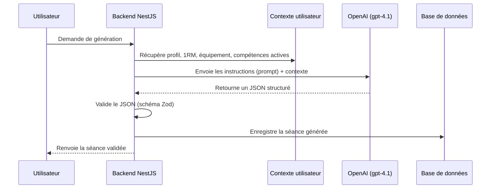

# Génération de séances par intelligence artificielle

Ce document explique comment Training Camp génère des séances d'entraînement personnalisées par IA. Il s'adresse aux Product Owners souhaitant comprendre le fonctionnement global, et aux développeurs découvrant le pattern à respecter pour tout nouveau sport.

## Pourquoi ce mécanisme ?

Chaque sport (cross-training, force, running, vélo, mobilité, compétences, programmes d'entraînement) dispose de son propre générateur IA. Un service séparé analyse également les séances terminées.

Tous ces générateurs suivent le **même pattern** : ils appellent OpenAI avec des instructions précises, puis valident strictement la réponse avant de l'enregistrer.

## Comment ça fonctionne

L'utilisateur demande une séance. Le backend enrichit la demande avec son profil complet, puis interroge l'intelligence artificielle. La réponse est systématiquement vérifiée avant d'être stockée, afin d'éviter qu'un contenu mal formé n'atteigne la base de données.

## Les générateurs existants

| Module | Service | Rôle |
|---|---|---|
| `workouts` | `AIWorkoutGeneratorService` | Génère les WOD de cross-training, extrait un WOD depuis du texte brut, retrouve un WOD officiel connu |
| `skills` | `AISkillGeneratorService` | Génère un programme de progression sur une compétence gymnique ou d'haltérophilie |
| `strength` | `AIStrengthGeneratorService` | Génère les séances de force / musculation |
| `running` | `AIRunningGeneratorService` | Génère les séances de course à pied |
| `biking` | `AIBikingGeneratorService` | Génère les séances de vélo |
| `mobility` | `AIMobilityGeneratorService` | Génère les séances de mobilité |
| `training-programs` | `AIProgramGeneratorService` | Génère des programmes d'entraînement complets sur plusieurs semaines |
| `workout-sessions` | `WorkoutAnalysisService` | Analyse une séance terminée et produit un retour personnalisé |

## Contexte utilisateur partagé

**`UserContextService`** (exporté par `WorkoutsModule`) fournit à tous les générateurs les mêmes informations sur l'utilisateur : niveau sportif, 1RM (records de force), équipement disponible, blessures, objectifs, séances récentes, et compétences actives en cours de progression. Cela garantit que chaque séance générée est cohérente avec le profil réel de l'utilisateur, quel que soit le sport.

> **Détail technique**
>
> Chaque service instancie un client `OpenAI` et appelle `chat.completions.create` avec :
> - `model: 'gpt-4.1'`
> - `response_format: { type: 'json_object' }` — force une réponse JSON
> - un prompt système (règles métier, structure attendue) et un prompt utilisateur (paramètres de la demande)
>
> La réponse brute est d'abord parsée en JSON, puis validée avec un schéma **Zod** dédié au module (ex. `GeneratedWorkoutSchema`). Trois cas d'erreur sont gérés explicitement :
>
> | Erreur | Cause | Réponse HTTP |
> |---|---|---|
> | JSON invalide | L'IA n'a pas renvoyé un JSON exploitable | `400 BadRequestException` |
> | Échec de validation Zod | La structure ne respecte pas le schéma attendu | `400 BadRequestException` avec le détail des champs en erreur |
> | `{"error": "UNKNOWN_WOD"}` | L'IA ne connaît pas avec certitude le WOD demandé (ex. un WOD CrossFit Open trop récent) | `400 BadRequestException('UNKNOWN_WOD')` |
>
> Pour contourner la limite de connaissance de GPT-4.1 (pas de WOD CrossFit Open postérieur à début 2025), l'endpoint `POST /workouts/lookup` accepte un champ `referenceData` : les détails exacts du WOD sont alors injectés dans le prompt plutôt que demandés à l'IA.

## Sécurité

Toutes les routes de génération sont protégées par `JwtAuthGuard` (authentification obligatoire) et limitées à 10 requêtes par minute par utilisateur via `@Throttle()`, afin de maîtriser les coûts d'appel à l'API OpenAI.
