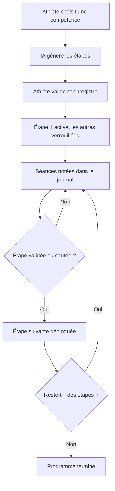

# Programmes de compétences (skills)

Ce document décrit comment un athlète progresse vers une compétence technique, comme le muscle-up ou le handstand walk. Il s'adresse aux Product Owners et aux développeurs qui touchent au module `skills`.

## Principe

- Un **programme** vise une compétence précise.
- Il est découpé en **étapes** progressives, chacune avec un critère de validation mesurable.
- Une seule étape est active à la fois. La suivante se débloque quand l'athlète valide ou saute l'étape en cours.
- Chaque séance de travail technique est notée dans un **journal**.

Les programmes actifs sont transmis au coach IA. Les WOD générés tiennent donc compte des compétences en cours.

## Cycle de vie d'un programme

L'IA propose le programme, mais rien n'est enregistré avant la validation de l'athlète. Le programme se termine automatiquement quand toutes les étapes sont validées ou sautées.

## Contenu d'une étape

| Élément | Exemple |
|---|---|
| Titre et description | « Kipping pull-up contrôlé » |
| Critère de validation | 5 répétitions, 30 secondes, 60 kg… |
| Exercices recommandés | Séries, répétitions, repos, intensité |
| Conseils du coach | Points techniques et erreurs fréquentes |
| Durée estimée | En semaines |
| Fréquence et moment | Ex. 3 fois par semaine, en début de séance |
| Échauffement | Préparation spécifique |

Types de critères possibles : répétitions, temps, charge, qualité, distance, nombre de pas.

## Statuts

| Élément | Statuts possibles |
|---|---|
| Programme | Actif, terminé, en pause, abandonné |
| Étape | Verrouillée, en cours, validée, sautée |

Une étape **sautée** compte comme franchie : l'athlète a dépassé ce palier.

## Catégories

Gymnastique, haltérophilie, force et mobilité.

## Lien avec le reste de l'application

- **Calendrier** : une séance de compétence se planifie dans `scheduled_activities` (type `skill`). Voir [Calendrier et planification](calendrier-planification.md).
- **Diagnostic** : l'avancement de chaque programme actif apparaît dans le diagnostic. Voir [Diagnostic de performance](diagnostic-performance.md).

> **Détail technique**
>
> | Endpoint | Rôle |
> |---|---|
> | `POST /skills/generate-ai` | Génère un programme (aperçu, non enregistré). Limité à 10/min |
> | `POST /skills` | Enregistre le programme et crée ses étapes |
> | `GET /skills`, `GET /skills/:id` | Liste et détail |
> | `PATCH /skills/:id` | Change le statut du programme |
> | `PATCH /skills/:id/steps/:stepId` | Change le statut d'une étape, débloque la suivante |
> | `POST /skills/progress` | Ajoute une entrée au journal |
> | `GET /skills/progress/step/:stepId` | Journal d'une étape |
> | `DELETE /skills/progress/:logId`, `DELETE /skills/:id` | Suppressions |
>
> - La réponse de l'IA est validée par `GeneratedSkillProgramSchema` (Zod), avec au moins 2 étapes.
> - Tables : `skill_programs`, `skill_program_steps`, `skill_progress_logs` (`performance_data` en `jsonb`).
> - Toute modification invalide le cache de `UserContextService`, pour que l'IA voie l'état à jour.
> - Pages : `/skills` (liste), `/skills/new` (création), `/skills/[id]` (suivi), `/crossfit/skills` (grille).
