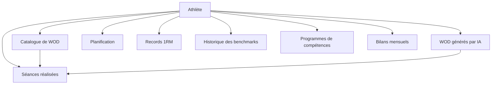

# Schéma de base de données

Ce document présente les tables de Training Camp et leurs relations. Il s'adresse aux développeurs qui travaillent sur le backend ou les migrations, et aux Product Owners qui veulent comprendre l'organisation des données.

## Vue d'ensemble

Toutes les données sont rattachées à un athlète. Une séance réalisée provient soit du catalogue, soit d'un WOD généré par IA. Les séances, les 1RM et les benchmarks alimentent le diagnostic de performance.

## Tables principales

### Athlète et matériel

| Table | Rôle |
|---|---|
| `users` | Profil : niveau, physiologie, objectifs, blessures |
| `equipments` / `user_equipments` | Référentiel du matériel et matériel disponible pour chaque athlète |

### Séances

| Table | Rôle |
|---|---|
| `workouts` | Catalogue : WOD officiels, benchmarks (Fran, Grace…), WOD créés par l'athlète |
| `exercises` / `workout_exercises` | Référentiel des exercices et leur place dans un WOD du catalogue |
| `personalized_workouts` | WOD généré par IA pour un athlète, avec les paramètres utilisés (`params_json`) |
| `workout_sessions` | Séance réellement réalisée : score, charges, RPE, notes, analyse IA |

### Planification

| Table | Rôle |
|---|---|
| `user_workout_schedule` | WOD planifié à une date, avec statut (prévu, complété, sauté) et recommandation du coach |
| `scheduled_activities` | Autres activités planifiées : compétences (`skill`), créneaux `wod` et `conditioning` posés depuis le planificateur de la semaine |

### Suivi de performance

| Table | Rôle |
|---|---|
| `one_rep_maxes` / `one_rep_max_history` | 1RM actuel par mouvement, et son évolution dans le temps |
| `benchmark_history` | Chaque score réalisé sur un benchmark, avec le niveau calculé |
| `tracking_reports` | Dernier bilan mensuel rédigé par l'IA |

### Compétences

| Table | Rôle |
|---|---|
| `skill_programs` | Programme de progression vers une compétence |
| `skill_program_steps` | Étapes du programme |
| `skill_progress_logs` | Journal des séances de travail technique |

## Tables obsolètes

Ces tables existent encore en base mais ne sont plus lues par le code.

| Table | Remplacée par |
|---|---|
| `user_workouts` | `workouts` et `personalized_workouts` |
| `workout_logs` | `workout_sessions` |
| `training_programs` / `user_program_enrollments` | Rien : les programmes d'entraînement ont été retirés |

Les tables des anciens modules (running, vélo, mobilité, force) ont été supprimées par migration. L'historique de force a été repris dans `workout_sessions`.

> **Détail technique**
>
> - `workout_sessions.results` est un `jsonb`. Son contrat est décrit dans [Enregistrement d'une séance](flux-log-workout.md).
> - Une session référence soit `workout_id`, soit `personalized_workout_id`, jamais les deux.
> - `scheduled_activities.activity_id` est une référence polymorphe, sans clé étrangère. Pour le type `skill`, elle pointe vers `skill_programs`.
> - Identifiants **UUID** générés par l'extension PostgreSQL `pgcrypto`, colonnes en `snake_case`.
> - Migrations : `backend/src/database/migrations/`. Seeds : `backend/src/database/seeds/`.
