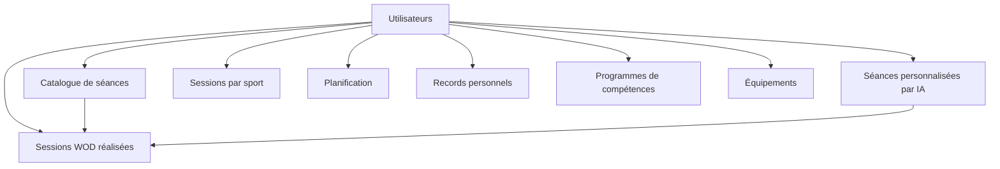

# Schéma de base de données

Ce document présente les tables principales de Training Camp et leurs relations. Il s'adresse aux développeurs travaillant sur le backend ou les migrations, ainsi qu'aux Product Owners souhaitant comprendre comment les données sont organisées.

## Vue d'ensemble

Chaque donnée est rattachée à un utilisateur. Le catalogue de séances et les séances générées par IA alimentent les sessions réalisées. La planification, les records personnels, les compétences et l'équipement sont gérés indépendamment, mais tous consultés par les générateurs IA pour personnaliser les séances.

## Tables principales

| Table | Rôle |
|---|---|
| `users` | Profil complet de l'utilisateur : niveau sportif, physiologie, objectifs, blessures, équipement disponible. |
| `workouts` | Catalogue des séances de référence (WOD officiels, benchmarks, séances créées par un utilisateur). |
| `exercises` / `workout_exercises` | Référentiel des exercices et leur usage détaillé dans une séance du catalogue. |
| `personalized_workouts` | Séance générée par IA pour un utilisateur à une date donnée, avec un instantané des paramètres utilisés (`params_json`). |
| `workout_sessions` | Séance de cross-training ou de programme réellement réalisée par l'utilisateur (résultats, durée, notes). |
| `user_workout_schedule` | Planification d'un WOD du catalogue à une date donnée, avec son statut (prévu, complété, sauté). |
| `scheduled_activities` | Registre unifié des activités planifiées tous sports confondus, utilisé par le calendrier. |
| `one_rep_maxes` / `one_rep_max_history` | Charge maximale actuelle par mouvement, et historique de son évolution dans le temps. |
| `skill_programs` / `skill_program_steps` / `skill_progress_logs` | Programme de progression sur une compétence, ses étapes, et le journal des séances de travail technique. |
| `equipments` / `user_equipments` | Référentiel du matériel disponible et association avec chaque utilisateur. |
| `running_sessions`, `biking_sessions`, `strength_sessions` | Séances réalisées propres à chaque sport (running, vélo, force), indépendantes de `workout_sessions`. |

> **Détail technique**
>
> Les tables `user_workouts` et `workout_logs`, créées lors des premières migrations, ne sont plus référencées par le code applicatif actuel : elles ont été remplacées respectivement par `workouts`/`personalized_workouts` et par `workout_sessions`. Elles restent en base pour compatibilité mais peuvent être considérées comme obsolètes.
>
> `workout_sessions.workout_id` est nullable : une session référence soit un `workout_id` (séance du catalogue), soit un `personalized_workout_id` (séance générée par IA), jamais les deux à la fois.
>
> `scheduled_activities.activity_id` est une référence polymorphique (sans contrainte de clé étrangère) : selon `activity_type`, elle pointe vers `running_sessions`, `biking_sessions` ou `strength_sessions`.
>
> Toutes les tables utilisateur utilisent des identifiants **UUID** générés par l'extension PostgreSQL `pgcrypto`, et les colonnes suivent la convention `snake_case`.
