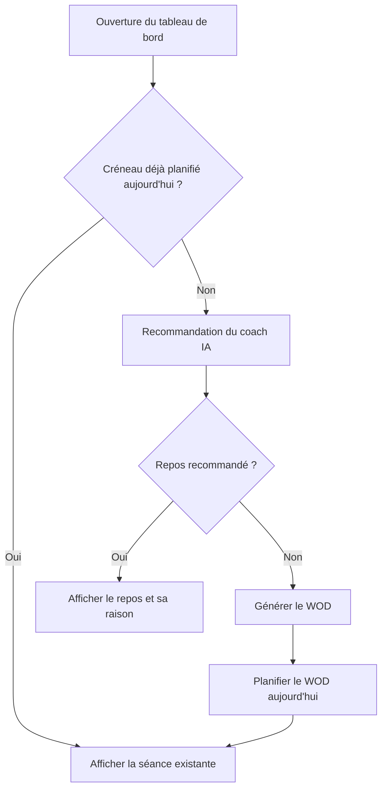

# Séance du jour et coach IA

Ce document explique comment Training Camp décide chaque jour de la séance à faire. Il s'adresse aux Product Owners et aux développeurs qui touchent aux modules `recommendations` et `workouts`.

## Principe

L'athlète n'a rien à construire. Chaque jour, le coach IA :

1. analyse les séances récentes et le diagnostic de performance ;
2. décide s'il faut s'entraîner ou se reposer, et sur quel type de séance ;
3. génère le WOD correspondant et le place dans le calendrier du jour.

L'explication du coach est enregistrée avec la séance. L'athlète voit donc toujours la raison qui a produit **cette** séance.

## Déroulement

Si un créneau existe déjà, qu'il soit planifié à la main ou généré plus tôt, rien n'est généré. En cas d'échec de l'IA, la carte propose de générer une séance manuellement.

## Ce que contient une recommandation

| Champ | Contenu |
|---|---|
| Sport recommandé | `crossfit` ou `rest` (repos) |
| Type de séance | Ex. AMRAP, EMOM, force + metcon |
| Urgence | Faible, moyenne ou élevée |
| Raison | Pourquoi ce choix aujourd'hui |
| Conseil du coach | Point d'attention pour la séance |
| Durée suggérée | En minutes |
| Focus et consignes | Facultatifs, transmis au générateur de WOD |

## Autres automatismes du même type

Aucun cron serveur n'est utilisé : l'hébergement Render n'est pas toujours actif. Ces tâches se déclenchent donc depuis l'application.

| Automatisme | Déclencheur | Fréquence |
|---|---|---|
| Séance du jour | Affichage de la carte « Séance du jour » | Une fois par jour |
| Bilan mensuel de progression | Connexion | Une fois par mois calendaire |
| Test de benchmark mensuel | Connexion | Un benchmark planifié par mois |

Le benchmark mensuel choisit en priorité un benchmark jamais testé, puis le plus ancien. Il est placé sur le premier jour libre à partir de J+3.

> **Détail technique**
>
> - Endpoint : `GET /api/recommendations/daily-session/check` → `DailySessionService.checkAndGenerateDailySession()`.
> - La recommandation vient de `RecommendationsService`, avec un cache mémoire de 2 heures par athlète. Ce cache est perdu à chaque redémarrage du backend.
> - `GET /recommendations/next-session` lit la recommandation ; `POST /recommendations/next-session/refresh` la régénère.
> - Le WOD est enregistré dans `workouts` (`ai_generated: true`, privé), puis planifié dans `user_workout_schedule`.
> - La recommandation est copiée dans `user_workout_schedule.coach_recommendation`.
> - Côté frontend, `TodaySessionCard` mutualise les appels simultanés (StrictMode) pour éviter deux générations.
> - Côté backend, un conflit de date entre deux appels concurrents renvoie le créneau existant au lieu d'une erreur.
> - Une génération est coûteuse : deux appels OpenAI (recommandation puis WOD).
